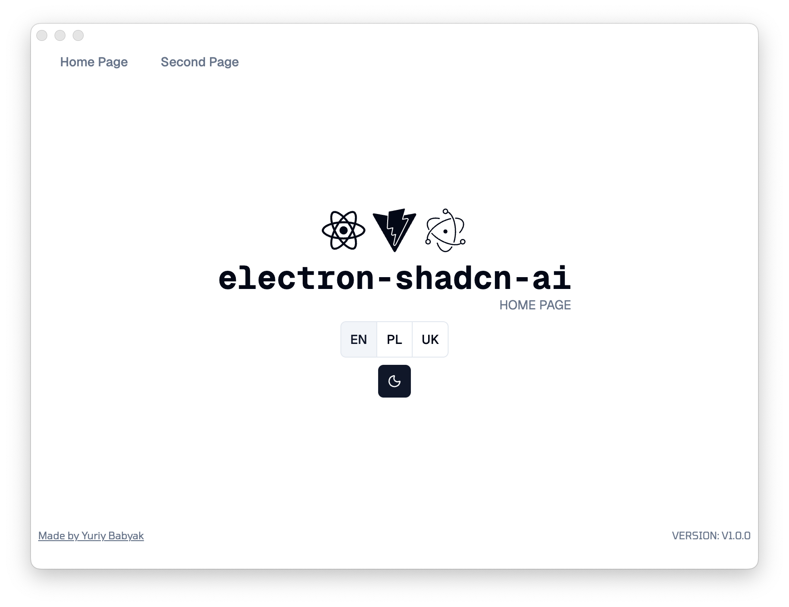

# electron-shadcn-ai

**DDD-aligned Electron template optimized for AI-assisted development (vibe-coding)**

Fork of [electron-shadcn](https://github.com/LuanRoger/electron-shadcn) — restructured with DDD architecture and AI guidance.

<div align="center">

[](https://github.com/user-attachments/assets/80e102bc-bd9c-4d34-a81d-2509e0c36227)

**Click to watch the demo** ▶️

</div>

## ✨ Features

- **DDD Architecture** — Clean separation: `main/`, `renderer/`, `ipc/`, `actions/`, `shared/`
- **AI Vibe-Coding Ready** — [`AI.md`](AI.md) with architecture docs, conventions, and workflows (symlinked to `AGENTS.md`/`CLAUDE.md`)
- **Type-Safe IPC** — oRPC + Zod for validated main↔renderer communication
- **Modern Tooling** — Biome (10-100x faster than ESLint), Bun, TanStack Router
- **Security First** — Context isolation enabled, nodeIntegration disabled

## 🛠️ Tech Stack

### Core
- [Electron 39](https://www.electronjs.org) (Forge + Vite)
- [React 19](https://reactjs.org) + TypeScript (strict mode)
- [TanStack Router](https://tanstack.com/router) (file-based routing)

### UI
- [Tailwind CSS v4](https://tailwindcss.com)
- [shadcn/ui](https://ui.shadcn.com)
- [Lucide](https://lucide.dev) icons
- [Geist](https://vercel.com/font) as default font
- [i18next](https://www.i18next.com) for internationalization

### IPC & Validation
- [oRPC](https://orpc.unnoq.com) — Type-safe IPC communication
- [Zod](https://zod.dev) — Runtime schema validation

### Developer Experience
- [Biome](https://biomejs.dev) — Fast linter and formatter (replaces ESLint + Prettier)
- [Bun](https://bun.sh) — Package manager

### Testing
- [Vitest](https://vitest.dev) — Unit testing
- [Playwright](https://playwright.dev) — E2E testing
- [React Testing Library](https://testing-library.com/docs/react-testing-library/intro)

### Packaging & Distribution
- [Electron Forge](https://www.electronforge.io)

## 🚀 Quick Start

```bash
git clone https://github.com/yuriyward/electron-shadcn-ai.git
cd electron-shadcn-ai
bun install
bun run dev
```

## 📁 Project Structure

```
src/
├── main/       # Main process
├── preload/    # Context bridge
├── renderer/   # React UI (components, features, layouts, lib)
├── ipc/        # IPC handlers (main-side)
├── actions/    # IPC wrappers (renderer-side)
├── shared/     # Cross-process types/constants
├── routes/     # File-based routing
└── styles/     # Global CSS
```

See [`docs/FILE-STRUCTURE.md`](docs/FILE-STRUCTURE.md) for details.

## 🤖 AI-Ready Development

Unified AI instructions across tools — update [`AI.md`](AI.md) once, apply everywhere:

| File | For |
|------|-----|
| `AI.md` | Main guidance (architecture, conventions, workflows) |
| `AGENTS.md` | Cursor, Codex, Gemini (symlink) |
| `CLAUDE.md` | Claude/Anthropic (symlink) |

## 📋 Commands

| Command | Purpose |
|---------|---------|
| `bun run dev` | Run app |
| `bun run fix` | Auto-fix + lint (Biome) |
| `bun run verify` | fix + unit tests |
| `bun run verify-full` | fix + tests + build + docs |
| `bun run test` | Unit tests |
| `bun run test:e2e` | E2E tests |
| `bun run build` | Build installers |
| `bun run docs` | Regenerate structure docs |

## 🔄 Auto Update

> [!WARNING]
> Auto update works only for open-source GitHub repos. Private repos need a custom update server — see [Electron docs](https://www.electronjs.org/docs/latest/tutorial/updates).

Uses [update-electron-app](https://github.com/electron/update-electron-app) with GitHub Releases. The `publish` script creates releases (requires `GITHUB_TOKEN`). See [`.github/workflows/publish.yaml`](.github/workflows/publish.yaml).

## 📚 Documentation

- **This fork:** [`AI.md`](AI.md), [`docs/FILE-STRUCTURE.md`](docs/FILE-STRUCTURE.md)
- **Upstream:** [electron-shadcn docs](https://docs.luanroger.dev/electron-shadcn) (Forge config, publishing, general Electron concepts)

## 📄 License

MIT — see [LICENSE](LICENSE)
