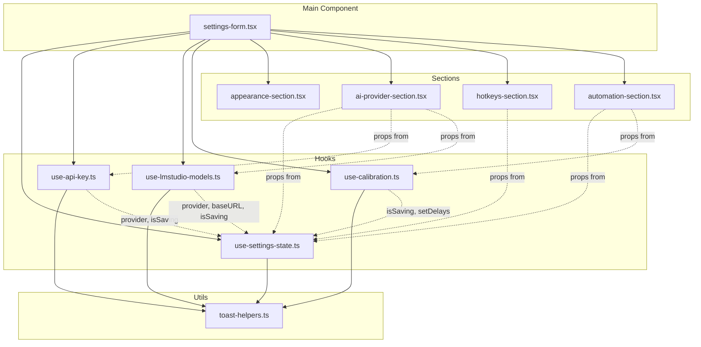

# Settings Form Refactoring Plan

## Overview

The file [`src/renderer/features/settings/settings-form.tsx`](src/renderer/features/settings/settings-form.tsx) is currently **803 lines**, violating the 300-line limit specified in AI.md. This plan details how to refactor it into smaller, focused modules.

---

## 1. Current State Analysis

### 1.1 State Variables (22 total)

| Variable | Type | Purpose | Lines |
|----------|------|---------|-------|
| `provider` | `AIProvider` | Selected AI provider | 82 |
| `model` | `string` | Selected AI model | 83 |
| `role` | `RewriteRole` | Rewrite mode (grammar/grammar-tone) | 84 |
| `reasoningEffort` | `ReasoningEffort` | OpenAI reasoning effort level | 85-86 |
| `textVerbosity` | `TextVerbosity` | OpenAI text verbosity level | 87 |
| `apiKey` | `string` | Current API key input | 88 |
| `apiKeyPreview` | `string` | Masked preview of saved key | 89 |
| `hasKey` | `boolean` | Whether API key exists | 90 |
| `isSaving` | `boolean` | Form submission loading state | 91 |
| `isEncryptionAvailable` | `boolean \| null` | System keychain availability | 92-94 |
| `lmstudioBaseURL` | `string` | LM Studio server URL | 95-97 |
| `isTestingConnection` | `boolean` | LM Studio connection test loading | 98 |
| `lmstudioDiscoveredModels` | `string[]` | Models fetched from LM Studio | 99-101 |
| `lmstudioModelsBaseURL` | `string \| null` | URL used for last model fetch | 102-104 |
| `fieldErrors` | `Record<string, string>` | Form validation errors | 105 |
| `fixSelection` | `string` | Fix selection hotkey | 107 |
| `togglePopup` | `string` | Toggle popup hotkey | 108 |
| `clipboardSyncDelayMs` | `number` | Clipboard sync delay setting | 110 |
| `selectionDelayMs` | `number` | Selection delay setting | 111 |
| `isCalibrating` | `boolean` | Calibration loading state | 112 |
| `calibration` | `AutomationCalibrationResult \| null` | Last calibration result | 113-114 |
| `calibrationText` | `string` | Text used for calibration | 116-118 |

### 1.2 Refs (1 total)

| Ref | Type | Purpose | Line |
|-----|------|---------|------|
| `calibrationFieldRef` | `HTMLTextAreaElement \| null` | Reference to calibration textarea | 119 |

### 1.3 Callbacks & Handlers (10 total)

| Function | Purpose | Lines |
|----------|---------|-------|
| `addSuccessToast()` | Show success toast notification | 121-123 |
| `addErrorToast()` | Show error toast notification | 125-128 |
| `loadSettings()` | Load settings from IPC | 130-148 |
| `loadApiKeyStatus()` | Check if API key exists for provider | 150-158 |
| `handleProviderChange()` | Handle AI provider selection change | 244-253 |
| `handleSaveApiKey()` | Save API key via IPC | 263-277 |
| `handleDeleteApiKey()` | Delete API key via IPC | 279-290 |
| `handleFetchLMStudioModels()` | Fetch models from LM Studio server | 292-320 |
| `handleSaveSettings()` | Validate and save all settings | 322-362 |
| `handleCalibrateAutomation()` | Run automation calibration | 364-401 |

### 1.4 Effects (5 total)

| Effect | Purpose | Lines |
|--------|---------|-------|
| Load settings + check encryption | Initial data load | 160-173 |
| Load API key status | Reload when provider changes | 175-177 |
| Calibration focus request listener | Handle IPC focus requests | 179-242 |
| Reset LM Studio models on URL change | Clear models when URL changes | 255-261 |

### 1.5 Computed Values (4 total)

| Variable | Purpose | Lines |
|----------|---------|-------|
| `apiKeyPlaceholder` | Placeholder text for API key input | 403-405 |
| `hotkeyFields` | Configuration array for hotkey inputs | 406-421 |
| `lmstudioPopularModels` | Popular models for LM Studio | 423 |
| `lmstudioExtraModels` | Discovered models not in popular list | 424-427 |

---

## 2. Identified Concerns

### Concern 1: Settings State Management
- All 22 state variables
- `loadSettings()` callback
- Initial settings load effect
- Form validation and submission (`handleSaveSettings`)

### Concern 2: API Key Management
- `apiKey`, `apiKeyPreview`, `hasKey`, `isEncryptionAvailable` state
- `loadApiKeyStatus()` callback
- `handleSaveApiKey()`, `handleDeleteApiKey()` handlers
- API key status load effect

### Concern 3: LM Studio Model Discovery
- `lmstudioBaseURL`, `isTestingConnection`, `lmstudioDiscoveredModels`, `lmstudioModelsBaseURL` state
- `handleFetchLMStudioModels()` handler
- URL change effect (reset models)
- `lmstudioPopularModels`, `lmstudioExtraModels` computed values

### Concern 4: Calibration Logic
- `clipboardSyncDelayMs`, `selectionDelayMs`, `isCalibrating`, `calibration`, `calibrationText` state
- `calibrationFieldRef` ref
- `handleCalibrateAutomation()` handler
- Calibration focus request listener effect

### Concern 5: AI Provider UI Section
- Provider select field
- Model select/combobox field (with LM Studio special handling)
- Role select field
- OpenAI-specific fields (reasoning effort, text verbosity)
- API key input section

### Concern 6: Hotkeys UI Section
- `fixSelection`, `togglePopup` state
- `hotkeyFields` configuration
- Hotkey input fields rendering

### Concern 7: Automation UI Section
- Calibration card with button and textarea
- Clipboard sync delay input
- Selection delay input
- Calibration results display

### Concern 8: Appearance UI Section
- Theme toggle
- Language toggle

---

## 3. Proposed File Structure

```
src/renderer/features/settings/
├── settings-form.tsx           # Main orchestrator (~120 lines)
├── hooks/
│   ├── use-settings-state.ts   # Settings state management (~100 lines)
│   ├── use-api-key.ts          # API key management (~80 lines)
│   ├── use-lmstudio-models.ts  # LM Studio discovery (~70 lines)
│   └── use-calibration.ts      # Calibration logic (~100 lines)
├── sections/
│   ├── appearance-section.tsx  # Theme & language (~40 lines)
│   ├── ai-provider-section.tsx # AI provider fields (~180 lines)
│   ├── hotkeys-section.tsx     # Hotkeys fields (~60 lines)
│   └── automation-section.tsx  # Automation fields (~120 lines)
└── utils/
    └── toast-helpers.ts        # Toast notification helpers (~20 lines)
```

### 3.1 File Details

#### [`settings-form.tsx`](src/renderer/features/settings/settings-form.tsx) (~120 lines)

**Purpose:** Main orchestrator component that composes all sections and hooks.

**Code to keep:**
- Form wrapper with validation
- Section composition
- Submit handler coordination

**Exports:**
```typescript
export default function SettingsForm(): JSX.Element
```

**Dependencies:**
- All hooks from `./hooks/`
- All sections from `./sections/`
- UI components from `@/renderer/components/ui/`

---

#### [`hooks/use-settings-state.ts`](src/renderer/features/settings/hooks/use-settings-state.ts) (~100 lines)

**Purpose:** Manages core settings state and persistence.

**Code to move:**
- State: `provider`, `model`, `role`, `reasoningEffort`, `textVerbosity`, `lmstudioBaseURL`, `fixSelection`, `togglePopup`, `clipboardSyncDelayMs`, `selectionDelayMs`, `isSaving`, `fieldErrors`
- `loadSettings()` callback
- Initial settings load effect
- `handleSaveSettings()` logic (validation + IPC call)
- `handleProviderChange()` handler

**Exports:**
```typescript
export interface UseSettingsStateReturn {
  // AI settings
  provider: AIProvider;
  setProvider: (provider: AIProvider) => void;
  model: string;
  setModel: (model: string) => void;
  role: RewriteRole;
  setRole: (role: RewriteRole) => void;
  reasoningEffort: ReasoningEffort;
  setReasoningEffort: (effort: ReasoningEffort) => void;
  textVerbosity: TextVerbosity;
  setTextVerbosity: (verbosity: TextVerbosity) => void;
  lmstudioBaseURL: string;
  setLmstudioBaseURL: (url: string) => void;

  // Hotkey settings
  fixSelection: string;
  setFixSelection: (hotkey: string) => void;
  togglePopup: string;
  setTogglePopup: (hotkey: string) => void;

  // Automation settings
  clipboardSyncDelayMs: number;
  setClipboardSyncDelayMs: (ms: number) => void;
  selectionDelayMs: number;
  setSelectionDelayMs: (ms: number) => void;

  // Form state
  isSaving: boolean;
  fieldErrors: Record<string, string>;

  // Handlers
  handleProviderChange: (provider: AIProvider) => void;
  handleSaveSettings: (event: React.FormEvent) => Promise<void>;
}

export function useSettingsState(): UseSettingsStateReturn
```

---

#### [`hooks/use-api-key.ts`](src/renderer/features/settings/hooks/use-api-key.ts) (~80 lines)

**Purpose:** Manages API key state and operations.

**Code to move:**
- State: `apiKey`, `apiKeyPreview`, `hasKey`, `isEncryptionAvailable`
- `loadApiKeyStatus()` callback
- API key status load effect
- `handleSaveApiKey()` handler
- `handleDeleteApiKey()` handler
- `apiKeyPlaceholder` computed value

**Exports:**
```typescript
export interface UseApiKeyReturn {
  apiKey: string;
  setApiKey: (key: string) => void;
  apiKeyPreview: string;
  hasKey: boolean;
  isEncryptionAvailable: boolean | null;
  apiKeyPlaceholder: string;
  handleSaveApiKey: () => Promise<void>;
  handleDeleteApiKey: () => Promise<void>;
}

export function useApiKey(
  provider: AIProvider,
  isSaving: boolean
): UseApiKeyReturn
```

---

#### [`hooks/use-lmstudio-models.ts`](src/renderer/features/settings/hooks/use-lmstudio-models.ts) (~70 lines)

**Purpose:** Manages LM Studio model discovery.

**Code to move:**
- State: `isTestingConnection`, `lmstudioDiscoveredModels`, `lmstudioModelsBaseURL`
- `handleFetchLMStudioModels()` handler
- URL change effect (reset models)
- `lmstudioPopularModels`, `lmstudioExtraModels` computed values

**Exports:**
```typescript
export interface UseLMStudioModelsReturn {
  isTestingConnection: boolean;
  discoveredModels: string[];
  popularModels: ModelConfig[];
  extraModels: string[];
  handleFetchModels: () => Promise<void>;
  resetModels: () => void;
}

export function useLMStudioModels(
  provider: AIProvider,
  baseURL: string,
  isSaving: boolean
): UseLMStudioModelsReturn
```

---

#### [`hooks/use-calibration.ts`](src/renderer/features/settings/hooks/use-calibration.ts) (~100 lines)

**Purpose:** Manages automation calibration logic.

**Code to move:**
- State: `isCalibrating`, `calibration`, `calibrationText`
- `calibrationFieldRef` ref
- `handleCalibrateAutomation()` handler
- Calibration focus request listener effect

**Exports:**
```typescript
export interface UseCalibrationReturn {
  isCalibrating: boolean;
  calibration: AutomationCalibrationResult | null;
  calibrationText: string;
  setCalibrationText: (text: string) => void;
  calibrationFieldRef: React.RefObject<HTMLTextAreaElement>;
  handleCalibrate: () => Promise<void>;
}

export function useCalibration(
  isSaving: boolean,
  setClipboardSyncDelayMs: (ms: number) => void,
  setSelectionDelayMs: (ms: number) => void
): UseCalibrationReturn
```

---

#### [`sections/appearance-section.tsx`](src/renderer/features/settings/sections/appearance-section.tsx) (~40 lines)

**Purpose:** Theme and language toggle UI.

**Code to move:**
- Appearance section JSX (lines 437-451)

**Exports:**
```typescript
export function AppearanceSection(): JSX.Element
```

---

#### [`sections/ai-provider-section.tsx`](src/renderer/features/settings/sections/ai-provider-section.tsx) (~180 lines)

**Purpose:** AI provider configuration UI.

**Code to move:**
- AI Provider section JSX (lines 453-698)
- Provider select
- LM Studio base URL field
- Model select/combobox
- Role select
- OpenAI-specific fields
- API key input section

**Exports:**
```typescript
export interface AIProviderSectionProps {
  // From useSettingsState
  provider: AIProvider;
  model: string;
  role: RewriteRole;
  reasoningEffort: ReasoningEffort;
  textVerbosity: TextVerbosity;
  lmstudioBaseURL: string;
  isSaving: boolean;
  onProviderChange: (provider: AIProvider) => void;
  onModelChange: (model: string) => void;
  onRoleChange: (role: RewriteRole) => void;
  onReasoningEffortChange: (effort: ReasoningEffort) => void;
  onTextVerbosityChange: (verbosity: TextVerbosity) => void;
  onLmstudioBaseURLChange: (url: string) => void;

  // From useApiKey
  apiKey: string;
  apiKeyPreview: string;
  hasKey: boolean;
  isEncryptionAvailable: boolean | null;
  apiKeyPlaceholder: string;
  onApiKeyChange: (key: string) => void;
  onSaveApiKey: () => Promise<void>;
  onDeleteApiKey: () => Promise<void>;

  // From useLMStudioModels
  isTestingConnection: boolean;
  discoveredModels: string[];
  popularModels: ModelConfig[];
  extraModels: string[];
  onFetchModels: () => Promise<void>;
}

export function AIProviderSection(props: AIProviderSectionProps): JSX.Element
```

---

#### [`sections/hotkeys-section.tsx`](src/renderer/features/settings/sections/hotkeys-section.tsx) (~60 lines)

**Purpose:** Global shortcuts configuration UI.

**Code to move:**
- Hotkeys section JSX (lines 700-713)
- `hotkeyFields` configuration

**Exports:**
```typescript
export interface HotkeysSectionProps {
  fixSelection: string;
  togglePopup: string;
  onFixSelectionChange: (value: string) => void;
  onTogglePopupChange: (value: string) => void;
}

export function HotkeysSection(props: HotkeysSectionProps): JSX.Element
```

---

#### [`sections/automation-section.tsx`](src/renderer/features/settings/sections/automation-section.tsx) (~120 lines)

**Purpose:** Automation settings and calibration UI.

**Code to move:**
- Automation section JSX (lines 715-798)
- Calibration card
- Delay input fields

**Exports:**
```typescript
export interface AutomationSectionProps {
  // From useSettingsState
  clipboardSyncDelayMs: number;
  selectionDelayMs: number;
  isSaving: boolean;
  onClipboardSyncDelayChange: (ms: number) => void;
  onSelectionDelayChange: (ms: number) => void;

  // From useCalibration
  isCalibrating: boolean;
  calibration: AutomationCalibrationResult | null;
  calibrationText: string;
  calibrationFieldRef: React.RefObject<HTMLTextAreaElement>;
  onCalibrationTextChange: (text: string) => void;
  onCalibrate: () => Promise<void>;
}

export function AutomationSection(props: AutomationSectionProps): JSX.Element
```

---

#### [`utils/toast-helpers.ts`](src/renderer/features/settings/utils/toast-helpers.ts) (~20 lines)

**Purpose:** Reusable toast notification helpers.

**Code to move:**
- `addSuccessToast()` function
- `addErrorToast()` function

**Exports:**
```typescript
export function addSuccessToast(title: string): void
export function addErrorToast(title: string, error: unknown): void
```

---

## 4. Dependencies Diagram



---

## 5. Migration Steps

### Step 1: Create utility files
1. Create `utils/toast-helpers.ts` with toast helper functions
2. Verify imports work correctly

### Step 2: Extract hooks (in dependency order)
1. Create `hooks/use-settings-state.ts` - core state management
2. Create `hooks/use-api-key.ts` - depends on provider from settings state
3. Create `hooks/use-lmstudio-models.ts` - depends on provider and baseURL from settings state
4. Create `hooks/use-calibration.ts` - depends on isSaving and setters from settings state

### Step 3: Extract section components
1. Create `sections/appearance-section.tsx` - no props needed
2. Create `sections/hotkeys-section.tsx` - simple props
3. Create `sections/automation-section.tsx` - props from settings state and calibration hook
4. Create `sections/ai-provider-section.tsx` - most complex, props from multiple hooks

### Step 4: Refactor main component
1. Update `settings-form.tsx` to use extracted hooks
2. Replace inline JSX with section components
3. Wire up props between hooks and sections

### Step 5: Cleanup and verification
1. Run `bun run fix` to auto-fix linting issues
2. Run `bun run verify` to ensure tests pass
3. Manually test all settings functionality

---

## 6. Estimated Line Counts Summary

| File | Estimated Lines | Concerns |
|------|-----------------|----------|
| `settings-form.tsx` | ~120 | Orchestration |
| `hooks/use-settings-state.ts` | ~100 | State management, validation |
| `hooks/use-api-key.ts` | ~80 | API key CRUD |
| `hooks/use-lmstudio-models.ts` | ~70 | Model discovery |
| `hooks/use-calibration.ts` | ~100 | Calibration logic |
| `sections/appearance-section.tsx` | ~40 | Theme/language UI |
| `sections/ai-provider-section.tsx` | ~180 | AI config UI |
| `sections/hotkeys-section.tsx` | ~60 | Hotkeys UI |
| `sections/automation-section.tsx` | ~120 | Automation UI |
| `utils/toast-helpers.ts` | ~20 | Toast utilities |
| **Total** | **~890** | |

**Note:** Total lines increase slightly due to:
- Type definitions for hook returns and component props
- Import statements in each file
- Export statements

However, each individual file stays well under the 300-line limit, and concerns are properly separated.

---

## 7. Risk Mitigation

### Risk: State synchronization between hooks
**Mitigation:** The main component acts as the single source of truth, passing state down to hooks that need it. Hooks don't directly communicate with each other.

### Risk: Prop drilling complexity
**Mitigation:** Section components receive flat props objects. If prop drilling becomes unwieldy, consider a context provider in a future iteration.

### Risk: Breaking existing functionality
**Mitigation:**
- Extract one piece at a time
- Run tests after each extraction
- Keep the original file as reference until migration is complete

### Risk: Circular dependencies
**Mitigation:** The dependency graph is strictly hierarchical:
- Utils have no internal dependencies
- Hooks depend only on utils
- Sections depend only on UI components
- Main component orchestrates everything
